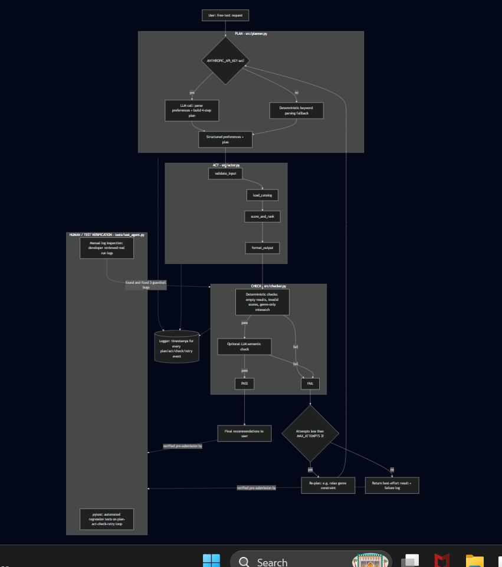

# 🎵 Music Recommender Simulation

## Project Summary

This project is a simple content-based music recommender system built in Python. It recommends songs by comparing a user's preferred genre, mood, and energy level with the attributes of songs in a small music catalog. Each song receives a score based on how closely it matches the user's preferences, and the highest scoring songs are recommended along with a short explanation of why they were selected.

It has been extended with an **agentic Plan → Act → Check workflow**: instead of calling the recommender directly, a free-text request goes through a Planner (interprets the request and builds a step-by-step plan), an Actor (executes each step), and a Checker (verifies the output and triggers a retry with a revised plan if it fails). See [Agentic Workflow](#agentic-workflow) below.

---

## System Architecture



The request flows Plan → Act → Check, and a failed check re-plans and retries (capped at `MAX_ATTEMPTS`) before returning a final result.

Editable Mermaid source: [`diagrams/architecture.mmd`](diagrams/architecture.mmd) — treat that file as canonical and re-export the PNG above after changing it.

---

## How the System Works

This recommender uses a content-based approach. Instead of learning from other users, it compares the characteristics of each song with the user's preferences.

### Song Features

Each song includes the following information:

- Genre
- Mood
- Energy
- Tempo
- Valence
- Danceability
- Acousticness

### User Profile

The user provides:

- Preferred genre
- Preferred mood
- Preferred energy level

### Scoring Process

Each song is scored using three features:

- A matching genre receives **2 points**.
- A matching mood receives **1 point**.
- Songs with an energy level closer to the user's preferred energy receive a higher score.

After every song has been scored, the songs are sorted from highest to lowest score, and the top recommendations are returned with an explanation showing why each song was recommended.

---

## Agentic Workflow

The recommendation engine above (`src/recommender.py`) is unchanged. It's now wrapped in a Plan → Act → Check loop, split across four modules so each part of the "decision trail" can be pointed to independently:

| Module | Role |
|---|---|
| `src/planner.py` | **Plan.** Turns a free-text request (e.g. `"something chill for studying"`) into structured preferences (genre/mood/energy) and a 4-step plan. Uses Claude when `ANTHROPIC_API_KEY` is set; falls back to a deterministic keyword parser otherwise. |
| `src/actor.py` | **Act.** Executes the plan one discrete, independently-loggable step at a time: `validate_input` → `load_catalog` → `score_and_rank` → `format_output`. Only calls the existing, unmodified `recommender.py` functions. |
| `src/checker.py` | **Check.** A deterministic layer (non-empty results, valid score range, and a check that a genre-only match with a poor mood/energy fit doesn't slip through) runs first and is always available. An optional LLM semantic layer runs only if that passes, and is skipped gracefully if no API key is set. |
| `src/agent.py` | **Orchestrator.** Runs plan → act → check, and on a failed check, re-plans with feedback (e.g. drops a genre requirement that produced a poor match) and retries — capped at `MAX_ATTEMPTS = 3` so it can never loop forever. |
| `src/llm_client.py` | Shared Anthropic API wrapper used by the planner and checker: handles a missing key, network/API errors, and malformed JSON responses the same way in both places, always falling back instead of crashing. |

Every plan, action, and check decision is logged with a timestamp, both to the console and to a file under `logs/run_<UTC timestamp>.log`, via the shared logger in `src/logger.py`.

### Guardrails

- **Invalid input:** a blank request, or preferences with a missing key or an out-of-range energy value, is rejected with a clear error instead of surfacing as a confusing exception later.
- **Missing/malformed catalog:** a missing CSV or a bad row is caught in `actor.load_catalog` and reported as an actor error.
- **API/network errors:** any Anthropic API failure (timeout, rate limit, connection error) or an unparseable response is caught in `llm_client.py`, logged, and the caller falls back to deterministic logic rather than crashing.
- **Bad output:** the Checker's deterministic layer catches empty results, out-of-range scores, and a "genre matched but mood/energy don't" false positive; any failure feeds back into the Planner's next attempt.
- **Infinite retries:** capped at `MAX_ATTEMPTS = 3` in `src/agent.py`; after that, the agent returns its best-effort result with `verified=False` instead of retrying forever.

---

## Getting Started

### Setup

1. (Optional) Create a virtual environment.

```bash
python -m venv .venv
```

Windows:

```bash
.venv\Scripts\activate
```

Mac/Linux:

```bash
source .venv/bin/activate
```

2. Install dependencies.

```bash
pip install -r requirements.txt
```

3. (Optional) Enable the LLM-backed planner/checker.

```bash
cp .env.example .env
```

Then add your key to `.env`:

```
ANTHROPIC_API_KEY=your-key-here
```

The agent runs fine without this step — it uses a deterministic fallback for planning and skips the LLM semantic check.

4. Run the program.

```bash
# Runs 4 built-in demo requests (including one edge case that triggers a retry)
python -m src.main

# Or run a single custom request
python -m src.main "something chill and relaxed for studying"
```

---

## Running Tests

Run the tests with:

```bash
pytest
```

`tests/test_recommender.py` covers the original scoring logic. `tests/test_agent.py` covers the Plan → Act → Check loop end-to-end, including the retry case, with the LLM layer stubbed out so the suite is fully reproducible without an API key or network access.

---

## Sample Recommendation Output

Direct recommender output (no agent involved):

```text
Loaded songs: 18

Top Recommendations

--------------------------------------------------
🎵 Sunrise City by Neon Echo
Genre: pop | Mood: happy
Score: 3.98
Why: Genre match (+2.0), Mood match (+1.0), Energy similarity (+0.98)
--------------------------------------------------
🎵 Gym Hero by Max Pulse
Genre: pop | Mood: intense
Score: 2.87
Why: Genre match (+2.0), Energy similarity (+0.87)
--------------------------------------------------
🎵 Rooftop Lights by Indigo Parade
Genre: indie pop | Mood: happy
Score: 1.96
Why: Mood match (+1.0), Energy similarity (+0.96)
--------------------------------------------------
🎵 Night Drive Loop by Neon Echo
Genre: synthwave | Mood: moody
Score: 0.95
Why: Energy similarity (+0.95)
--------------------------------------------------
🎵 Storm Runner by Voltline
Genre: rock | Mood: intense
Score: 0.89
Why: Energy similarity (+0.89)
--------------------------------------------------
```

### Sample Agentic Run (Plan → Act → Check → Retry)

From `python -m src.main` with no `ANTHROPIC_API_KEY` set (deterministic fallback path). The 4th request is the edge case: "happy classical fan feeling energetic" matches the catalog's one classical track on genre alone, but its mood (melancholy) and energy (0.25) are a poor fit — the Checker catches this on attempt 1, the Agent re-plans without the genre constraint, and attempt 2 passes.

```text
=== Attempt 1/3 for request: "I'm a happy classical music fan feeling energetic" ===
[PLAN] (deterministic_fallback) preferences={'genre': 'classical', 'mood': 'happy', 'energy': 0.9}
       strategy={'require_genre_match': True, 'k': 5}
[ACT] validate_input: OK -> {'genre': 'classical', 'mood': 'happy', 'energy': 0.9}
[ACT] load_catalog: loaded 18 songs
[ACT] score_and_rank: filtered catalog to 1 songs matching genre=classical
[ACT] format_output: formatting 1 recommendation(s)
[CHECK] (deterministic) passed=False reason=top score 2.35 clears the threshold on genre match
        alone, but mood ('melancholy' vs requested 'happy') and energy (diff 0.65) are both a poor fit
=== Attempt 1 FAILED check (deterministic layer) ===

=== Attempt 2/3 for request: "I'm a happy classical music fan feeling energetic" ===
Deterministic planner relaxing genre requirement per retry feedback
[PLAN] (deterministic_fallback) preferences={'genre': 'classical', 'mood': 'happy', 'energy': 0.9}
       strategy={'require_genre_match': False, 'k': 5}
[ACT] score_and_rank: produced 5 recommendation(s)
[CHECK] (deterministic) passed=True reason=structural checks passed, top score 1.92
=== Attempt 2 PASSED check (skipped layer) ===

============================================================
Request: "I'm a happy classical music fan feeling energetic"
Verified: True (after 2 attempt(s))
============================================================
🎵 Sunrise City by Neon Echo
Genre: pop | Mood: happy
Score: 1.92
Why: Mood match (+1.0), Energy similarity (+0.92)
------------------------------------------------------------
```

Full timestamped logs for every run are written to `logs/run_<UTC timestamp>.log`.

---

## Experiments

I tested the recommender using several different user profiles, including High Energy Pop, Chill Lofi, Deep Intense Rock, and a Happy Classical Fan. Each profile produced different recommendations based on the selected preferences.

I also experimented with the scoring algorithm by reducing the genre weight from **2.0** to **1.0** and doubling the importance of energy. After making this change, songs with energy levels closer to the user's preferred energy ranked higher, even when they belonged to a different genre. This demonstrated how changing feature weights directly affects recommendation results.

---

## Limitations and Risks

This recommender only uses genre, mood, and energy when scoring songs. It does not consider tempo, lyrics, listening history, or user feedback. Because the dataset contains only 18 songs, the same recommendations may appear for different users. The algorithm also depends on exact genre and mood matches, so similar songs with different labels may receive lower scores.

---

## Reflection

This project helped me understand how recommendation systems use user preferences and item features to make personalized suggestions. I learned that even a simple scoring algorithm can produce recommendations that feel relevant when the right features are chosen.

I also learned that recommendation systems have limitations. Small datasets and simple scoring rules can introduce bias and reduce recommendation diversity. Testing different user profiles and changing the scoring weights showed how small changes in the algorithm can significantly affect the recommendations.